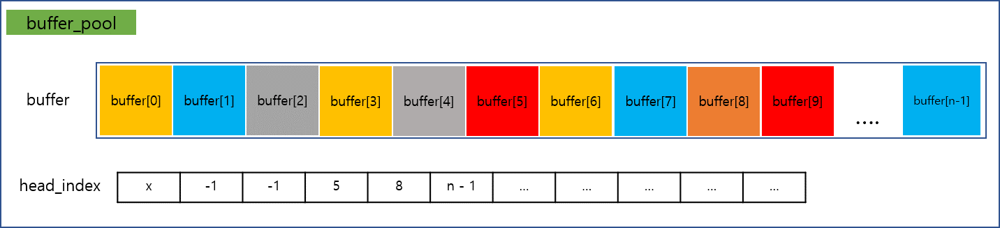
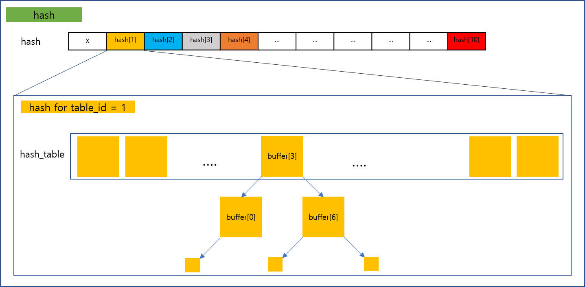
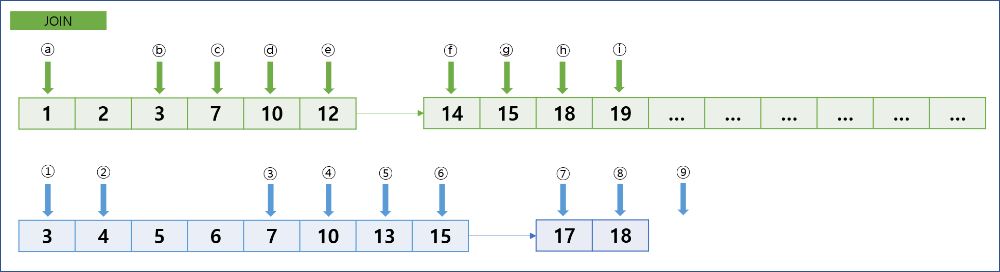

 
전보다 성능향상을 위해 buffer_pool 에 head_index 라는 배열을 추가 했습니다. 헤더페이지는 매우 빈번히 읽히므로 상수시간내로 접근하기 위해서입니다. 
예를들어 table_id = 4 인 테이블의 헤더가 buffer[8]->frame 에 저장되어 있다면 head_index[4] = 8 로, head_index 의 (table_id)번째 칸에 헤더페이지가 담긴 버퍼의 index 를 저장합니다.  
만약 table_id = 1 인 테이블의 헤더가 buffer 배열에 저장되어 있지 않다면, head_index[1] = -1 로 저장됩니다.  
버퍼가 가득 찼을 때 어떤 버퍼를 삭제할지는 저번과 마찬가지로 buffer 배열 상에서 clock_policy 에 의해 정해집니다.  
 

 
헤더페이지를 제외한 나머지 페이지들은 해시를 이용해 버퍼상에 존재하는지 탐색합니다.  
해시에서 중요한 요소는 해시함수와 해시테이블 크기인데, 해시함수는 func = x % (num_buf) 로 하였으며, 테이블 크기는 (num_buf) 로 하였습니다.  
테이블 크기를 저렇게 설정한 이유는 어차피 num_buf 만큼의 버퍼만 메모리에 존재할 텐데, 그 수보다 테이블 크기는 지나치다고 생각했습니다.  
해시함수를 저렇게 설정한 이유는 페이지가 0번부터 순차적으로 생성될 것이기 때문에 버퍼 크기로 나눈 나머지로 하는 것이 제일 고르게 분포될 것이라고 생각했습니다.  
그런데도 발생하는 collision 에 대해서는 chaining 을 수행합니다.  
하지만 단순한 링크드 리스트 방식으로 chaining 을 한다면, 매우 많은 양의 페이지가 생성되어 collision 이 발생할 때, 같은 hash_key 를 갖는 모든 buffer 를 보아야 할 수 있습니다.  
그래서 같은 hash_key 를 갖는 buffer 들에 대해 AVL_Tree 를 형성하도록 했습니다.  
비록 버퍼상에 존재하지 않아서 버퍼를 비우고 새로 적재할 때마다 트리에 삽입과 삭제를 해야하지만, num_buf 가 크면 클수록 그 횟수가 적어질 것이고, 삽입과 삭제보다 많이 이루어질 탐색은 보다 빠르게 할 수 있다고 생각하여 이런 디자인을 하였습니다.  
 

 
leaf 의 key 값들은 정렬되어 있으므로 Sort Merge Join 을 하였습니다.  
위 그림과 같이 두 테이블의 leaf 가 구성되어 있을 때 join 이 이루어지는 방식을 설명하겠습니다.  
1. 위쪽 테이블을 A, 아래쪽 테이블을 B 라 할 때, 맨 처음 각 key 값에 대한 포인터를 (a) 와 (1) 에 위치시킵니다.  
2. (a) 가 (1) 보다 작으므로 (a)가 크거나 같아질 때까지 옮겨줍니다. 위의 상황에서는 (a) 에서 (b)로 옮겨줍니다.  
3. (b) 와 (1) 의 key 값이 같으므로 join 결과를 str 에 저장하고, 각 포인터들을 그 다음인 (c) 와 (2) 로 옮깁니다.  
4. 이제는 (2) 가 (c) 보다 작으므로, (2) 가 (c) 보다 크거나 같아질 때까지 옮겨줍니다. 위의 상황에서는 (2) 에서 (3) 으로 옮겨줍니다.  
5. (c) 와 (3) 의 key 값이 같으므로 join 결과를 str 에 저장하고, 각 포인터들을 그 다음인 (d) 와 (4) 로 옮겨줍니다.  
6. (d) 와 (4) 의 key 값이 같으므로 join 결과를 str 에 저장하고, 각 포인터들을 그 다음인 (e) 와 (5) 로 옮겨줍니다.  
7. (e) 가 (5) 보다 작으므로 다음으로 옮겨야하는데 (e) 가 해당 leaf 의 마지막 record 이므로, 다음 leaf 를 읽어와 (e) 에서 (f) 로 위치시킵니다.  
8. (5) 가 (f) 보다 작으므로 (f) 보다 크거나 같을 때까지 옮겨줍니다. 위의 상황에서는 (5) 에서 (6) 으로 옮겨줍니다.  
9. 이제는 (f) 가 (6) 보다 작으므로, (f) 가 (6) 보다 크거나 같아질 때까지 옮겨줍니다. 위의 상황에서는 (f) 에서 (g) 으로 옮겨줍니다.  
10. (g) 와 (6) 의 key 값이 같으므로 join 결과를 str 에 저장하고, 각 포인터들을 그 다음인 (h) 와 (7) 로 옮겨줍니다.  
11. (7) 이 (h) 보다 작으므로 (h) 보다 크거나 같을 때까지 옮겨줍니다. 위의 상황에서는 (7) 에서 (8) 으로 옮겨줍니다.  
12. (h) 와 (8) 의 key 값이 같으므로 join 결과를 str 에 저장하고, 각 포인터들을 그 다음인 (i) 와 (9) 로 옮겨줍니다.  
13. (9) 가 B 의 마지막 leaf 의 마지막 record 를 읽은 후여서, 더이상 (9) 는 B 의 page 를 가리키고 있지 않습니다.  
    따라서 A 의 모든 페이지를 읽지 않았지만, 더이상 B 에서 나머지 A 의 record 와 같은 key 값을 가진 record 가 없으므로 비교를 중지합니다.  
14. 마지막으로 join 결과가 저장된 str 을 파일로 저장합니다.  
 
