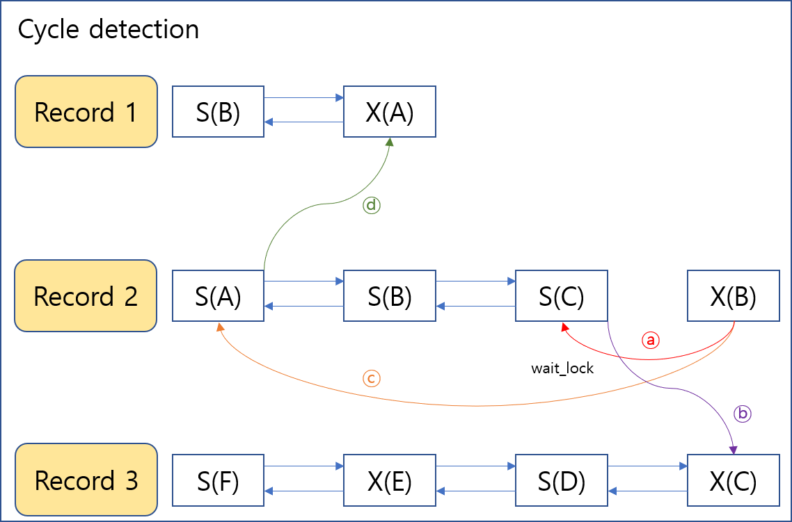

  
[1-1] Lock_hash_table   
초기 디자인에서 lock_hash_table 을 table_id 에 따라 page_num 을 key 로 갖는 unordered_map 을 이용하려 관리하려고 했습니다. 
그런데 이럴 경우 record 단위로 lock 을 잡기 위해 record 의 key 값으로 해당 페이지가 Lock_hash_table 에 있는지 검사하려니 문제가 있었습니다.  
page_num 과 record 의 key값에 상관관계가 딱히 없었습니다. 가장 좋은 방법은 페이지의 가장 작은 key 값과 가장 큰 key 값 사이라는 범위를 hash_key 로 갖는 hash 지만,  
이런 STL은 무엇이 있는지 잘 몰랐습니다. 그래서 그냥 tree 를 이용하기로 했습니다.  
루트부터 시작하여 해당 페이지의 가장 작은 key값보다 더 작은 key 를 갖는 record 를 찾는다면 왼쪽 자식노드로, 가장 큰 key값보다 더 큰 key를 갖는 record를 찾는다면 오른쪽 자식으로 
가장 작은 key와 가장 큰 key 사이의 key를 갖는 record를 찾는다면 해당 페이지를, 도달한 곳이 NULL 이라면 해당 페이지를 찾아서 노드를 tree에 달아주는 방식으로 탐색했습니다.  
hash를 이용하지 못 한것에는 조금 아쉬움이 있으나, 이 상황에 맞으면서 제가 구현할 수 있는 자료구조중 가장 효율적이라고 생각합니다.  
 

 
[1-2] table_slot_t   
Lock_hash_table 에 담는 것은 table_slot_t 라는 구조체입니다.  
리프페이지의 기본정보인 table_id, page_num, key 개수와 key 값의 배열, 트리를 유지하기 위한 left, right, 그리고 각 record lock의 처음과 끝을 가리키는 head, tail 포인터로 구성되어있습니다. 
 

 
[2] Trx_table   
트랜잭션 테이블은 tid를 hash_key 로 갖는 unordered_map을 이용하여 구현했습니다. 그래서 Trx_table 구현은 어려움없이 구현할 수 있었습니다.  
 

 
[3] buffer latch   
버퍼 풀에 해당하는 래치 한 개와 init_db 할 때 인자로 받은 수만큼의 래치 페이지 래치를 만듭니다.  
그리고 buffer_page_read 시에 buffer_pool_latch 를 잡고 해당 함수를 빠져 나갈 때 buffer_pool_latch 를 풀어줍니다. 
buffer_page_latch 는 buffer_page_read시에 잡으며, buffer_page_write를 통해 풀어줍니다.  
 

 
[4] cycle_detection   
제가 cycle_detection을 구현한 방법에는, lock_t 마다 갖고 있는 wait_lock들을 계속 탐색해가면서 추가하려는 lock의 owner와 같은 것이 있는지 검사합니다.  
wait_lock은 해당 lock이 동일 record에서 해제되기를 기다리는 lock 들을 저장하는 list 입니다. 위의 그림을 예를들어 설명하자면  
(a) 추가하려는 X(B)의 첫 wait_lock 인 S(C) 를 봅니다  
(b) 보았더니 S(C)는 record2에서 다른 lock이 해제되기를 기다리고 있지 않습니다. 그래서 S(C)의 owner인 C트랜잭션이 기다리고 있는 다른 lock 들을 봅니다. 
    하지만 기다리고 있는 것들 중 B트랜잭션은 없었습니다. 
(c) 이번에는 S(A)를 봅니다. 추가하려는 lock의 owner가 B트랜잭션이므로 S(B)는 보지 않습니다.  
(d) S(A)를 보았더니 이 lock 또한 record2에서 기다리고 있는 다른 lock이 없으므로, A트랜잭션이 기다리고 있는 다른 lock 들을 봅니다.  
    이번에는 S(B)를 A트랜잭션이 기다리고 있다는 것을 알아냈습니다. 만약 X(B)를 추가하면 B트랜잭션은 A트랜잭션을, A트랜잭션은 B트랜잭션을 기다리게 됩니다. 
 결국 X(B)를 추가하면 deadlock이 발생하므로 B트랜잭션을 abort시킵니다. 
이와같은 방법으로 각 lock들과 트랜잭션들이 기다리고 있는 lock들의 owner가 추가하려는 lock의 owner와 같은지 DFS로 탐색해가면서 비교합니다. 
 

 
[5] recover  
X lock 을 매달면서 해당 lock의 owner 트랜잭션에 log 리스트에 log_t 자료를 추가합니다.  
log_t 구조체에는 table_id, page_num, key, old_value, new_value 를 저장합니다. 
만약 abort를 해야한다면 이 log 리스트를 탐색하며 해당 페이지들의 new_value 들을 old_value 들로 되돌리고 log 리스트를 비웁니다.  
 

 
[6] 어려웠던 점  
2가지가 어려웠습니다. 첫번째로 latch를 걸고 잠들어서 모든 스레드가 할 일을 수행하지 못하고 무한 대기하는 것을 파악하는 것입니다.  
관리해야하는 latch가 buffer_pool_latch, buffer_page_latch, hash_table_latch, trx_pool_latch, 이 네개의 latch 를 어느 시점에 걸고 어느 시점에 풀어주어야 하는지 파악하는 것이 힘들었습니다 
두번째로 cycle_detection이 힘들었습니다. 다른 것들은 비교적 간단하였으나 deadlock인지 파악하기 위한 cycle_detection 함수를 구성하는 것이 매우 까다로웠습니다. 
그 중에서도 동일 record에 대해서 다시 lock을 시도하는 경우를 처리하는 것이 매우 어려웠습니다.  
왜냐하면 동일 트랜잭션이 S <-- S, S <-- X, X <-- S, X <-- X 처럼 S/X lock 후에 어떤 lock_mode로 시도하는지에 따라 동작이 조금씩 다르며, 심지어 전과 후의 lock의 시도 사이와 그 전에 다른 트랜잭션의 lock 
존재여부에 따라서도 동작이 조금씩 달라져야하기 때문에 어떤 상황인지 파악하는 코드, 행동을 수행하는 코드 모두 다소 복잡하게 코드를 짤 수 밖에 없었습니다. 
 

